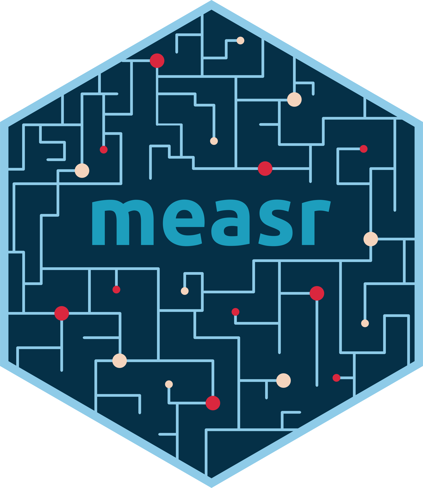

# Applied diagnostic classification models with measr 

measr is an R package designed to facilitate the estimation and evaluation of diagnostic classification models (DCMs; also called cognitive diagnostic models [CDMs]).
measr wraps the [Stan probabilistic programming language](https://mc-stan.org) to provide fully Bayesian methods for fitting models and evaluating model fit.
For more information on the measr package, see the [package website](https://measr.info).

This organization contains materials for workshops and tutorials that have been developed to introduce measr to different audiences.
Materials for each workshop include a workshop website, slides, exercises, and solutions.
